# 구조와 워크플로우: YouTube Subtitles 웹앱과 MCP 커넥터

이 문서는 웹앱과 MCP 커넥터가 어떤 부품으로 이루어져 있고, 요청이 어떤 경로로 흐르며, 코드를 고칠 때 무엇이 어디로 옮겨 가는지를 설명합니다. 도식은 Mermaid 문법으로 적었고, Mermaid를 그리지 못하는 뷰어를 위해 같은 그림을 PNG로도 `docs/diagrams/`에 넣어 각 도식 아래에 붙였습니다.

## 1. 한 장 요약

Mac mini 한 대에서 도는 Python 서버 하나가 세 가지 얼굴을 갖습니다. 브라우저용 웹 페이지, 프로그램용 REST API, 그리고 AI 앱용 MCP 엔드포인트입니다. 셋 다 같은 자막 엔진(yt-dlp와 변환기)과 같은 캐시를 씁니다. Tailscale Funnel이 이 서버에 공개 HTTPS 주소를 붙여 주므로 휴대폰 브라우저, Claude, ChatGPT가 모두 같은 주소로 들어옵니다.

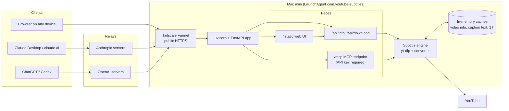

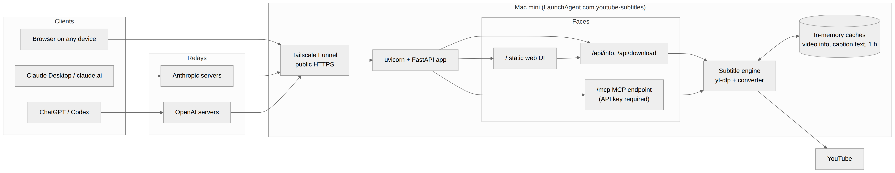

## 2. 부품

| 부품 | 위치 | 역할 |
| --- | --- | --- |
| LaunchAgent `com.youtube-subtitles` | Mac mini | 로그인 시 서버를 자동 시작하고 죽으면 다시 띄웁니다. 환경 변수(API 키, 공개 주소)를 넣어 줍니다. |
| uvicorn + FastAPI (`app/main.py`) | Mac mini, 포트 7860 | HTTP 서버. 정적 웹 페이지, REST API, MCP 엔드포인트를 한 프로세스에서 제공하고, 시각이 찍힌 로그를 남깁니다. |
| 자막 엔진 (`app/youtube.py`, `app/convert.py`) | 서버 안 | yt-dlp로 영상 정보와 자막 트랙을 가져오고, 원어와 업로더 자막을 골라 추천하며, TXT, SRT, VTT로 변환하고 문단을 정돈합니다. |
| 캐시 | 서버 메모리 | 영상 정보와 내려받은 자막 본문을 1시간 기억합니다. 같은 트랙을 여러 번 써도 유튜브에는 한 번만 요청합니다. |
| 웹 UI (`static/index.html`) | 서버가 배포, 브라우저에서 실행 | 주소 입력, 트랙과 형식 선택, 다운로드와 미리 보기 화면. REST API만 호출합니다. |
| MCP 서버 (`app/mcp_server.py`) | 서버 안 | 도구 세 개와 리소스를 AI 앱에 제공합니다. 세션을 유지하고, 사용자 확인 게이트를 검사하며, 메뉴 카드 HTML을 리소스로 내보냅니다. |
| 메뉴 카드 (`app/ui/menu.html`, 소스는 `ui/`) | 서버가 배포, Claude 안의 iframe에서 실행 | 트랙, 형식, 레이아웃 선택과 버튼들. 서버 도구를 직접 부르거나 Claude 입력창에 요청문을 넣습니다. |
| Tailscale Funnel | Mac mini | 포트 7860을 `https://dukwoos-mac-mini.tailb8572b.ts.net` 으로 공개합니다. 인증서와 외부 접속을 대신 처리합니다. |
| GitHub 저장소 | 클라우드 | 코드와 문서의 원본. 서버 실행에는 관여하지 않고, 수정 사항을 Mac으로 옮기는 통로입니다. |

## 3. 워크플로우

### 3.1 웹앱에서 자막 받기

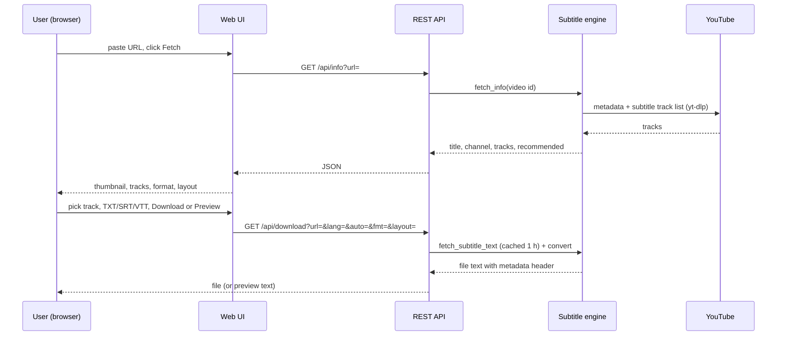

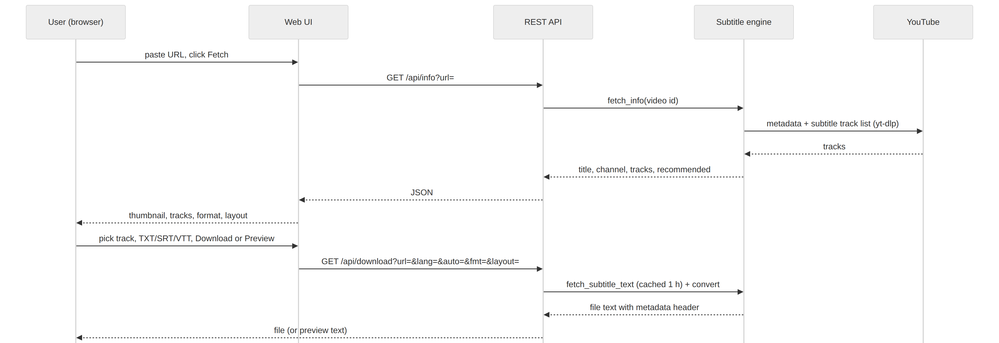

영상 정보 조회와 자막 다운로드가 분리되어 있고, 두 번째 요청부터는 캐시가 응답합니다. 자막 목록에는 업로더 자막(Original)과 영상 원어의 자동 자막만 나오고, 유튜브가 자주 거부하는 기계 번역 자막은 숨깁니다.

### 3.2 Claude에서 메뉴 카드로 쓰기

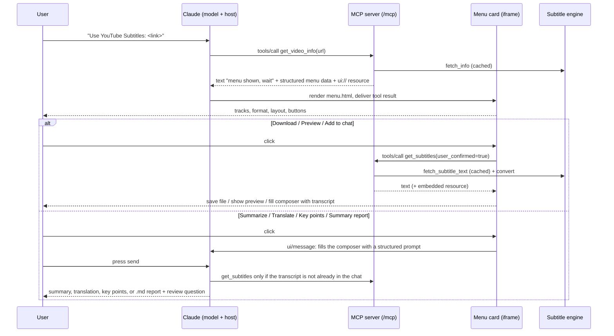

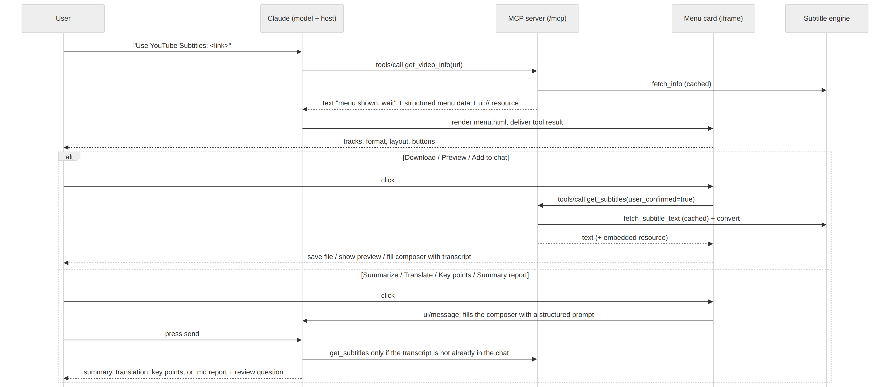

핵심 규칙은 세 가지입니다. 첫째, 링크가 오면 모델은 질문 없이 `get_video_info`를 먼저 부르고, 다음 단계는 서버가 결과 텍스트로 알려 줍니다. 둘째, `get_subtitles`와 `get_download_link`는 `user_confirmed=true`와 그 영상의 조회 기록이 있어야 실행되므로 모델이 메뉴를 건너뛸 수 없습니다. 셋째, 모델이 봐야 하는 내용(자막 전문, 요청문)은 입력창에 넣어 사용자가 전송하게 합니다. 이것이 Claude Desktop에서 확실히 동작하는 유일한 경로였습니다.

### 3.3 메뉴 카드가 없는 클라이언트 (ChatGPT, Claude Code)

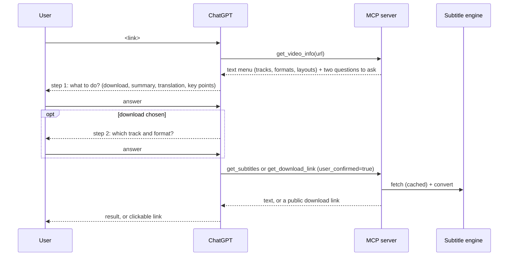

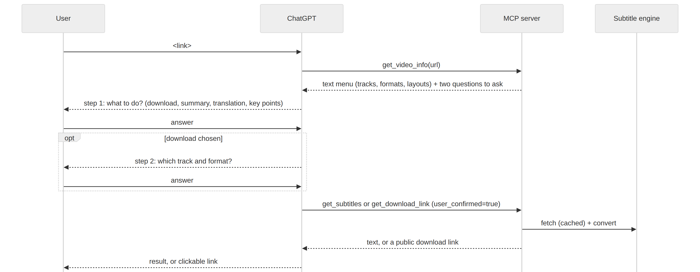

클라이언트가 초기화 때 앱 지원을 선언하지 않으면 서버가 같은 메뉴를 글로 돌려주고, 모델이 두 단계로 묻습니다. 파일은 서버가 만든 공개 다운로드 링크로 받습니다.

### 3.4 요청이 서버 안에서 거치는 단계

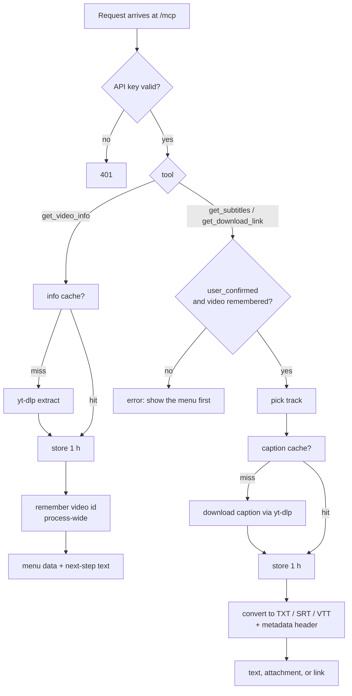

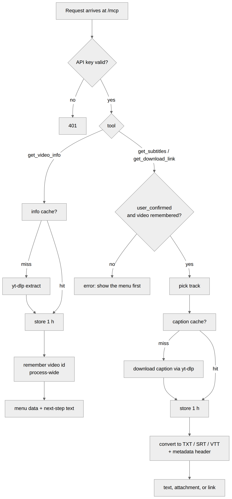

### 3.5 코드를 고쳐서 서버에 적용하기

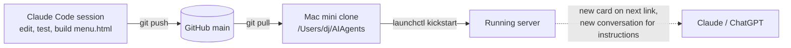

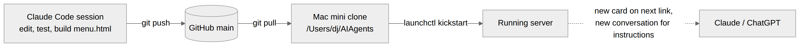

수정은 Claude Code 세션에서 하고(pytest 209개와 Playwright 스모크 59개 통과 확인), GitHub main에 푸시한 뒤 Mac에서 `git pull`과 재시작을 합니다. 메뉴 카드 문구를 바꿨으면 링크를 다시 보내 새 카드를 띄우면 되고, 서버 안내문이나 도구 정의를 바꿨으면 새 대화를 열어야 반영됩니다. 사용만 할 때는 GitHub도 Claude Code도 필요 없습니다.

## 4. 데이터와 보안

- 디스크에 저장하는 것은 없습니다. 영상 정보와 자막 본문은 메모리에 1시간만 있고, 서버를 재시작하면 사라집니다.
- MCP 엔드포인트는 API 키가 있어야 응답합니다. 키는 커넥터 설정의 헤더나 URL에만 두고 채팅에는 적지 않습니다. 웹 페이지와 REST API는 키 없이 열려 있으므로 공개 여부는 별도로 판단합니다.
- 클라이언트 요청은 Claude와 ChatGPT의 서버를 거쳐 들어오므로 로그의 접속 IP는 Anthropic이나 OpenAI 대역으로 찍힙니다.
- 유튜브 차단(봇 검사, PO 토큰, 데이터센터 IP 거부)은 가정용 IP인 Mac에서는 나타나지 않았습니다. 나타나면 쿠키 환경 변수와 PO 토큰 제공기가 준비되어 있습니다.

## 5. 더 읽을 문서

이용 절차는 `USER_GUIDE.ko.md`, 설계상의 교훈과 호스트별 동작은 `MCP_LESSONS.ko.md`, 기술 세부와 환경 변수는 `README.md`, 새 세션 시작은 `HANDOFF.ko.md`를 보면 됩니다.
